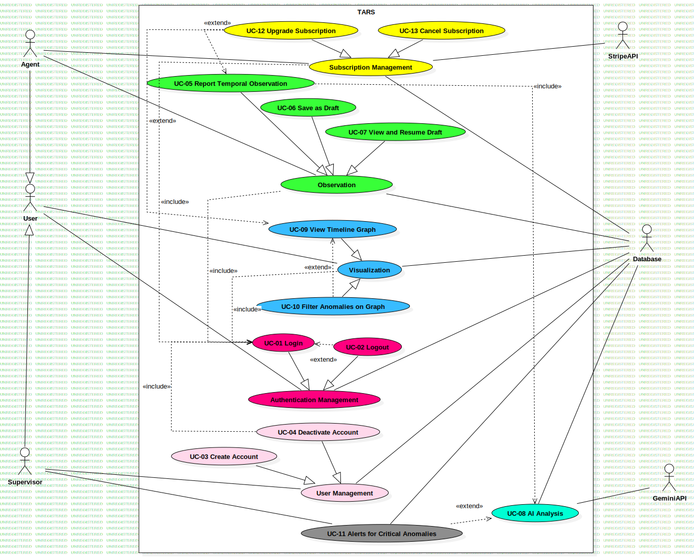
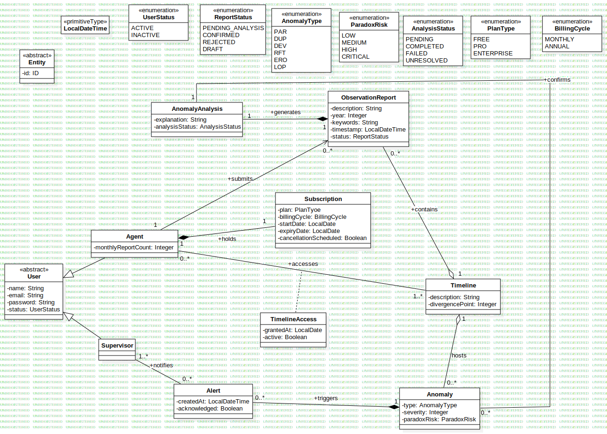

# TARS — System Specifications

## Overview

TARS (Temporal Anomaly Reporting System) is a web application for recording, monitoring, and analyzing temporal anomalies detected across a multiverse space-time continuum. It is used by agents and supervisors operating in timeline monitoring systems.

A fundamental aspect of the data architecture is that the database operates exclusively within a meta-linear, strictly monotonic, and causal time frame — server time. The system records paradoxes and anomalies but does not experience them: it acts as an external observer, immune to the inconsistencies it catalogues. Any non-linearity introduced into the monitored reality is the object of study, not a property of the system itself.

---

## System Boundary

The system boundary is named **TARS**.

### Actors

| Actor | Type | Description |
|---|---|---|
| Agent | Primary | Reports anomalies, manages drafts, manages their multiverse subscription. Timeline access is gated by subscription plan. |
| Supervisor | Primary | Creates and deactivates user accounts, receives critical anomaly alerts. |
| Gemini API | Secondary (system) | Triggered automatically on new anomaly submission to perform AI analysis. |
| Database | Secondary (system) | Queried by the AI analysis flow to retrieve correlated historical anomalies. |
| Stripe API | Secondary (system) | Handles payment processing for subscription upgrades and cancellations via Stripe Checkout redirect and webhook callbacks. |

### Use Case Diagram

### Domain Entities Diagram

---

## Anomaly Classification

TARS classifies temporal anomalies into 6 types. This classification is used in the reporting form and in AI analysis.

| Type | Code | Description | Typical Severity |
|---|---|---|---|
| Causal Paradox | PAR | Cause and effect are reversed; an event cancels its own cause | 4–5 (Critical) |
| Temporal Duplication | DUP | The same object or person exists simultaneously in two instances at the same moment | 3–4 (High) |
| Timeline Deviation | DEV | An event occurred differently from the reference timeline records | 2–4 (Medium–High) |
| Temporal Rift | RFT | Physical fracture in the space-time continuum; uncontrolled portal | 4–5 (Critical) |
| Temporal Erosion | ERO | The existence or memory of an element gradually disappears from all records | 3–5 (High–Critical) |
| Temporal Loop | LOP | A sequence of events repeats indefinitely without natural resolution | 2–3 (Medium) |

---

## Subscription Plans

An Agent's subscription determines which timelines (multiverses) they can report from and visualize. Plans are available on monthly or annual billing cycles.

| Plan | Timelines Accessible | Reports / Month | AI Analysis Priority |
|---|---|---|---|
| FREE | 1 timeline | 20 reports | Standard queue |
| PRO | 5 timelines | 200 reports | Standard queue |
| ENTERPRISE | Unlimited | Unlimited | Priority queue |

---

## Iteration Planning

The project follows iterative incremental development. Each iteration delivers a functional subset of the application.

### Iteration 1 — Core System (Weeks 1–3)
Goal: working authentication, user lifecycle management, and anomaly draft system.

| UC | Use Case | Priority | Justification |
|---|---|---|---|
| UC-01 | System Login | Critical | Prerequisite for all other functionality |
| UC-02 | Logout | Critical | Completes the authentication lifecycle |
| UC-03 | Create User Account | High | Required to set up roles and test agents |
| UC-04 | Deactivate User Account | Medium | Completes user lifecycle management |
| UC-06 | Save Anomaly as Draft | Medium | Foundational for UC-07; low complexity |
| UC-07 | View and Resume Draft | Medium | Depends on UC-06; completes draft lifecycle |

### Iteration 2 — Reporting, AI, Graph, and Alerts (Weeks 4–6)
Goal: full anomaly reporting with AI analysis, timeline graph visualization with filters, and critical alerts.

| UC | Use Case | Priority | Justification |
|---|---|---|---|
| UC-05 | Report Temporal Observation | Critical | Core user-facing workflow; triggers AI analysis and alerts |
| UC-08 | AI Analysis | Critical | Key differentiating feature; triggered by UC-05 |
| UC-09 | View Timeline Graph | High | Main visualization surface; requires anomaly data from iteration 1 |
| UC-10 | Filter Anomalies on Graph | High | Extends UC-09; implemented together |
| UC-11 | Alerts for Critical Anomalies | Medium | Depends on UC-08 being completed first |

### Iteration 3 — Billing and Polish (Weeks 7–9)
Goal: Stripe subscription integration, plan enforcement across UC-05 and UC-09, and final testing.

| UC | Use Case | Priority | Justification |
|---|---|---|---|
| UC-12 | Upgrade Subscription | High | Stripe integration; unlocks timeline and report quota enforcement |
| UC-13 | Cancel Subscription | Medium | Completes the subscription lifecycle; depends on UC-12 |

---

## Technical Stack

| Layer | Technology |
|---|---|
| Frontend | Angular, Tailwind CSS |
| Backend | Spring Boot, Hibernate ORM |
| Database | PostgreSQL |
| Cache / JWT Denylist | Redis |
| AI Integration | Gemini API |
| Payment | Stripe (test mode) |
| Deployment | Docker Compose |

Redis is used as an in-memory store for the JWT denylist, enabling O(1) token invalidation on logout without database overhead.
